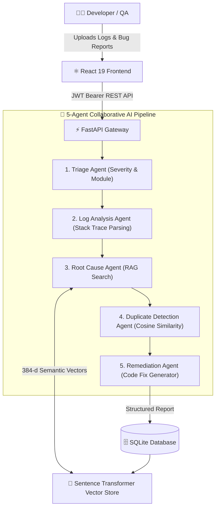

# BugLens – Intelligent Bug Diagnosis Platform with Fix Recommendation Assistance

An enterprise-grade, AI-powered Bug Diagnosis and Remediation Platform using a **5-Agent Collaborative AI Architecture** and **Retrieval-Augmented Generation (RAG)** with Sentence Transformers (`all-MiniLM-L6-v2`) for automated triage, stack trace & error log analysis, root cause diagnosis, semantic duplicate detection, and automated remediation.

Developed as a capstone project for the **Infosys Springboard Internship 2026**.

---

## 🌟 Key Capabilities & Features

### 🤖 5-Agent Multi-Agent AI Pipeline
1. **Triage Agent** — Classifies defect severity (`critical`, `high`, `medium`, `low`), priority (`P1`-`P4`), affected system module, and confidence score.
2. **Log Analysis Agent** — Parses structured error logs, captures stack frames, exception types, file paths, and root line numbers.
3. **Root Cause Agent (RAG)** — Queries high-dimensional Sentence Transformer embeddings (`all-MiniLM-L6-v2`, 384-d) against the Knowledge Base to extract precise root causes.
4. **Duplicate Detection Agent** — Calculates cosine similarity metrics to detect duplicate and related issues before investigation.
5. **Remediation Agent** — Synthesizes immediate workarounds and permanent architectural code fixes with verified snippets.

### 💼 Core Enterprise Modules
- 🔍 **Intelligent Bug Analysis** — Drag-and-drop file upload (logs, screenshots, attachments) with multi-tab input (Bug Report, Stack Trace, Error Log).
- 🧠 **RAG Knowledge Base** — Dynamically indexes resolved defect cases into semantic vector embeddings for continuous historical learning.
- 🔄 **Semantic Duplicate Detection** — Cosine similarity ranking with color-coded confidence thresholds (>80% duplicate, 50-80% similar).
- 📊 **Real-Time Analytics & Dashboard** — 9 live metric cards, severity breakdown, resolution trends, and weekly/monthly distributions.
- 👥 **Team & Role Management** — Invite team members, assign RBAC roles (`Admin`, `Manager`, `Developer`, `Viewer`), and track activity.
- 📑 **Defect Report Generation** — Generates daily, weekly, monthly, and developer performance reports with one-click CSV export and print-ready formats.
- 🔎 **Global Fast Search (Ctrl+K)** — Instant search across all bug records, knowledge articles, and remediation snippets.
- ⚙️ **Settings & Customization** — Theme toggle (Dark / Light / System), notification preferences, AI confidence sliders, and profile management.

---

## 🛠️ Technology Stack

| Layer | Technologies |
|-------|--------------|
| **Frontend** | React 19, TypeScript 5, Vite, Tailwind CSS v4, Framer Motion, Lucide Icons, Recharts, Axios, React Hot Toast |
| **Backend** | FastAPI, Python 3.13 / 3.14, SQLAlchemy ORM, SQLite, Pydantic v2, Python-Jose (JWT), Passlib (Bcrypt) |
| **AI / NLP & RAG** | Sentence Transformers (`all-MiniLM-L6-v2`), PyTorch, Scikit-Learn Cosine Similarity, Multi-Agent Pipeline |
| **Storage & Static** | SQLite DB (`buglens.db`), Static File Server (`/uploads` for screenshots & logs) |

---

## 🏗️ System Architecture



---

## 🚀 Quick Start Guide

### 1. Prerequisites
- **Node.js**: v18.0 or higher
- **Python**: v3.10 to v3.14
- **Git**

---

### 2. Backend Setup & Run

```bash
# 1. Open a terminal in project root
cd "c:\Users\Eswar Rao\OneDrive\Documents\Infosys Internship 2026"

# 2. Start the FastAPI backend server
py -3.13 -m uvicorn backend.main:app --host 0.0.0.0 --port 8000 --reload
```

- Backend API: **http://localhost:8000**
- Interactive Swagger API Docs: **http://localhost:8000/docs**
- Health check: **http://localhost:8000/health**

---

### 3. Frontend Setup & Run

```bash
# 1. Open a new terminal in frontend directory
cd frontend

# 2. Install dependencies (if not already installed)
npm install

# 3. Start Vite development server
npm run dev
```

- Web Application: **http://localhost:5173**

---

### 4. Default Demonstration Accounts

| Role | Email Address | Password | Permissions |
|------|---------------|----------|-------------|
| **Admin** | `admin@buglens.ai` | `admin123` | Full access across all settings, team, and diagnosis |
| **Developer** | `dev@buglens.ai` | `dev123` | Bug submission, analysis, resolution, KB access |

*Note: You can also register a new account anytime on the `/register` page.*

---

## 🧪 Verification & Audit Test Suite

To run the automated end-to-end integration test suite verifying all 18 endpoints, auth flows, file upload, multi-agent AI execution, RAG ingestion, and reports:

```bash
py -3.13 "scratch/test_full_platform_suite.py"
```

To run frontend TypeScript compilation and production bundle verification:

```bash
cd frontend
npm run build
```

---

## 📄 License & Acknowledgements

Developed by **Eswar Rao** for the **Infosys Springboard Internship 2026**.
All code, multi-agent workflows, vector store implementations, and database models are built and tested for enterprise submission.

